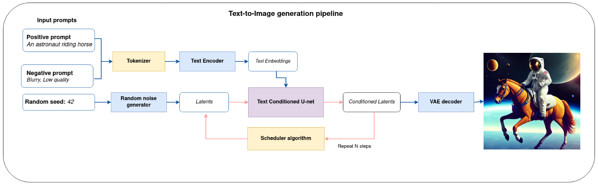
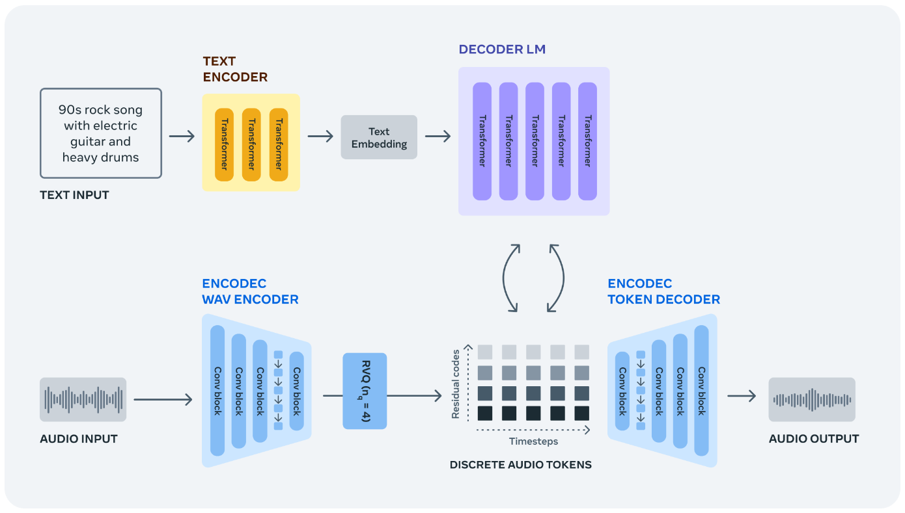

# DYNAMIC DIARY mini-project

## Team members
1. 김명준
2. 박도현
3. 우이준

## Purpose
DYNAMIC DIARY는 사용자가 텍스트로 입력한 일기를 영상과 소리로 출력해주는 프로그램입니다. OpenVINO 프레임워크와 3가지 인공지능 모델을 사용하여 일기 내용을 소리내어 읽어주는 동시에 일기 내용과 연관된 영상(이미지)을 보여주고 연관된 음악을 들려줍니다. 
현재 DYNAMIC DIARY에서 일기 내용과 연관된 음악을 출력하는 모델과 코드는 음악을 저장하는데 문제가 발생하여 제외된 상태입니다.  
The DYNAMIC DIARY is a program which takes a text entered by the user and outputs the appropriate image and sounds. Three artificial intelligence models are used with the OpenVINO framework to read out loud the diary entry, while simutaneously displaying an image and music related to the contents of the diary entry. 
The accompanying music has been omitted, along with the corresponding A.I. model due to errors in saving the model output.  

## Diagram

Stable Diffusion (OpenVINO sample #225, a latent diffusion model)  

MusicGen (OpenVINO sample #250, a single-stage autoregressive transformer model)  

Bark (OpenVINO sample #256, a multi-stage transformer model)  

## How to run

## Result
